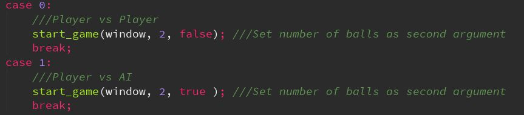
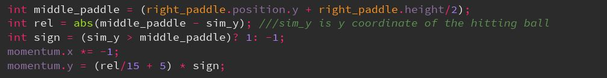

# Multiple-Ball-Pong
Pong supporting multiple balls, written in C++, using SFML library

# Modes
Game offers PvP mode and Player vs AI.
In PvP mode one player uses S and W keys for moving the paddle and second one uses arrows

# AI
AI algorithm is the simplest one. In each frame algorithm calculates which ball is closest to the paddle and moves the paddle up or down, in order to keep the middle of the paddle on the height of the closest ball.

# Balls

**Number of Balls**

> Quantity of balls for each mode can be changed in start_game function call inside of the main game loop.

**Balls physics**

>Screen below, shows ball momentum change, when hitting right paddle.

>For left paddle it's almost the same. Only x sign changes
